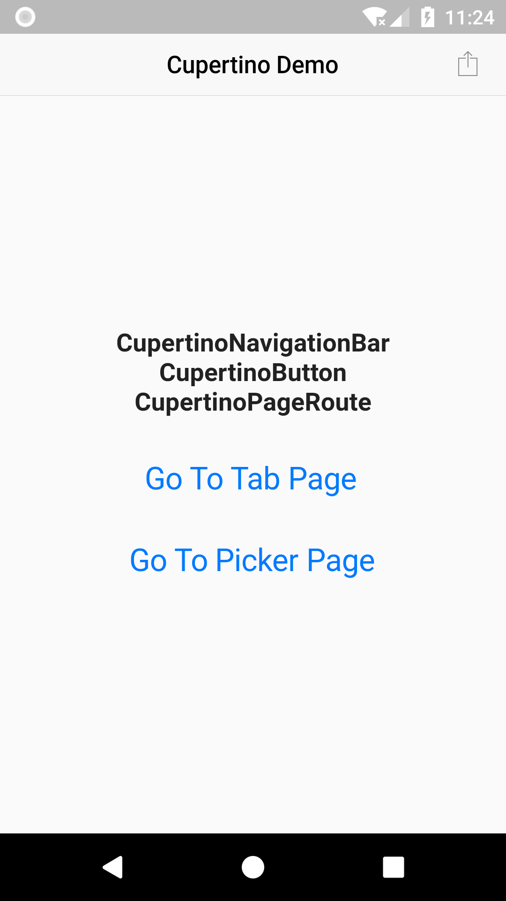
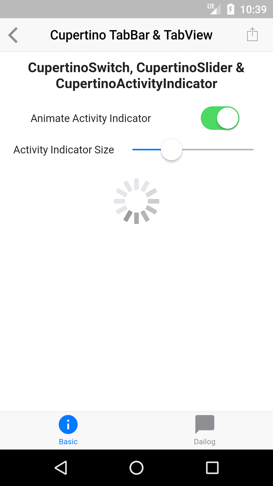
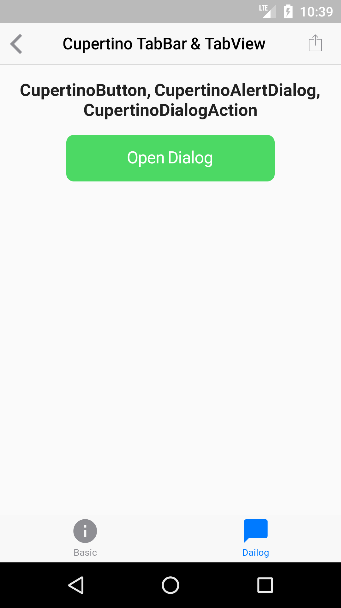
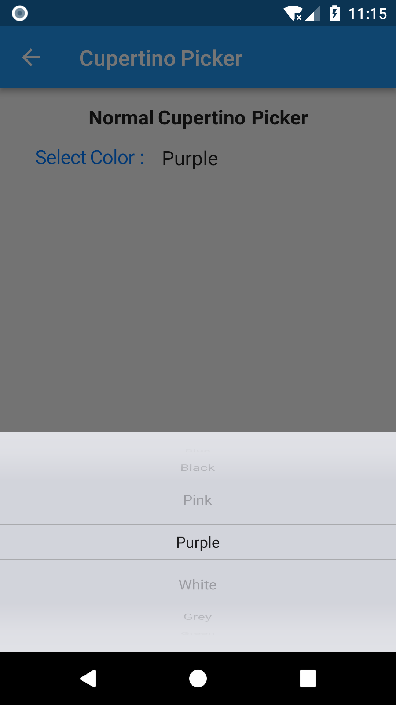
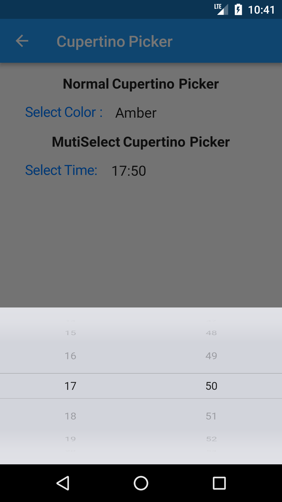

# Flutter Cupertino Demo

A new Flutter application to demonstrate the different Cupertino widgets.

# Preview

| Home | Basic Tab | Dialog Tab |
| ---- |---------- | ---------- |
|  |  |  |

| Cupertino Picker | MultiSelect Cupertino Picker |
| ---------------- | ---------------------------- |
|  |  |

## Getting Started

For help getting started with Flutter, view our online
[documentation](https://flutter.io/).
